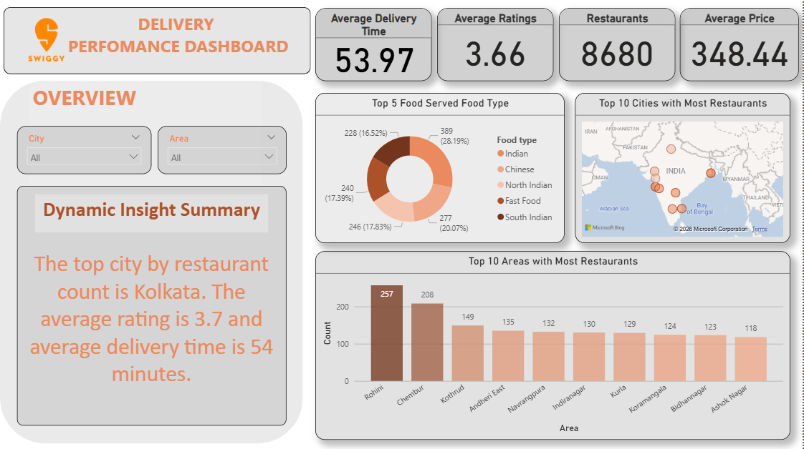

# Swiggy Delivery Performance Dashboard

## Project Overview
Interactive Power BI dashboard analyzing Swiggy restaurant delivery performance across 8,680 restaurants in multiple Indian cities — built to surface patterns in delivery time, ratings, pricing, and restaurant density that could inform operational and expansion decisions.

## Data Source
Dataset sourced from Kaggle: Swiggy Restaurant Dataset

## Key Findings
- Kolkata has the highest restaurant count of all cities tracked, with an average rating of 3.7 and average delivery time of 54 minutes — both close to the platform-wide average, suggesting high restaurant density doesn't significantly hurt service quality in this case
- Platform-wide average delivery time is 53.97 minutes across 8,680 restaurants, with an average rating of 3.66 and average order price of ₹348.44
- North Indian cuisine is the single most listed food type at 28.19% of all restaurants, followed by Fast Food (20.07%) and Chinese (17.83%) — together the top 3 categories account for ~66% of all listings
- At the area level, Rohini has the highest restaurant concentration (257 restaurants), nearly 25% more than the second-highest area (Chembur, 208) — indicating significant geographic clustering rather than even distribution

## Dashboard Features
- Interactive slicers for City and Area
- Donut chart for Top 5 Food Type distribution
- Map visualization showing Top 10 cities by restaurant count
- Bar chart showing Top 10 areas by restaurant density
- Dynamic insight summary that updates based on slicer selection

## Key KPIs Tracked
- Average Delivery Time
- Average Ratings
- Total Restaurants
- Average Price

## DAX Measures Used
```
Dynamic Avg Rating = ROUND(AVERAGE(swiggy_Data[Avg ratings]), 1)
```
Plus additional measures: Dynamic Delivery Time, Dynamic Insight Summary, Top City, and Total Ratings — built to power the live-updating insight summary panel based on slicer selection.

## Tools Used
- Power BI
- DAX
- Data Cleaning & Transformation

## Files Included
- `Swiggy_Delivery_Performance_Dashboard.pbix`
- `Dashboard_screenshot.png`
- `swiggy_data.csv`

## How to Use
Open the `.pbix` file in Power BI Desktop to explore the interactive dashboard with live filtering by City and Area, or view the static screenshot below.

## Dashboard Preview


## Author
**Kadheejathul Kubra**
Data Analyst | Power BI · Python · SQL
